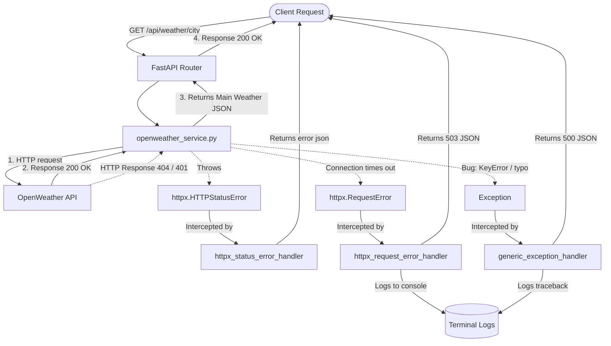

# Weather App Error Flow Diagram

This document contains a Mermaid flowchart explaining how HTTP requests and errors flow through the Weather Application.

```mermaid
flowchart TD
    Client([Client Request]) -->|GET /api/weather/city| FastAPI[FastAPI Router]
    FastAPI --> Service[openweather_service.py]

    %% Scenario 1: Success
    Service -->|1. HTTP request| API[OpenWeather API]
    API -->|2. Response 200 OK| Service
    Service -->|3. Returns Main Weather JSON| FastAPI
    FastAPI -->|4. Response 200 OK| Client

    %% Scenario 2: HTTPStatusError
    API -.->|HTTP Response 404 / 401| Service
    Service -.->|Throws| E1[httpx.HTTPStatusError]
    E1 -->|Intercepted by| H1[httpx_status_error_handler]
    H1 -->|Returns error json| Client

    %% Scenario 3: RequestError (Timeout)
    Service -.->|Connection times out| E2[httpx.RequestError]
    E2 -->|Intercepted by| H2[httpx_request_error_handler]
    H2 -->|Logs to console| Console[(Terminal Logs)]
    H2 -->|Returns 503 JSON| Client

    %% Scenario 4: Python Bug (Exception)
    Service -.->|Bug: KeyError / typo| E3[Exception]
    E3 -->|Intercepted by| H3[generic_exception_handler]
    H3 -->|Logs traceback| Console
    H3 -->|Returns 500 JSON| Client
```
